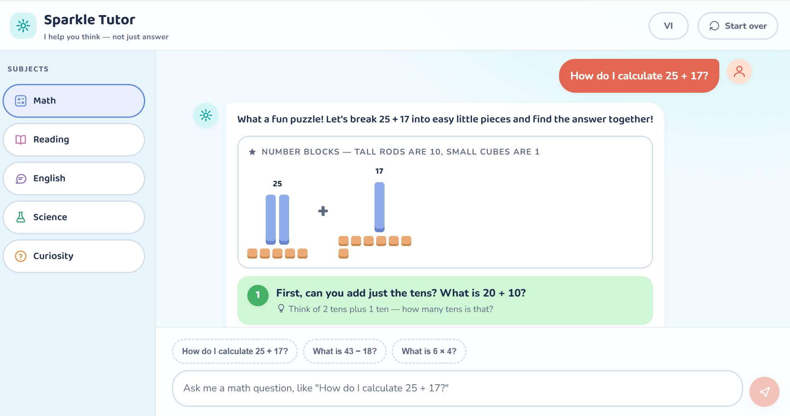
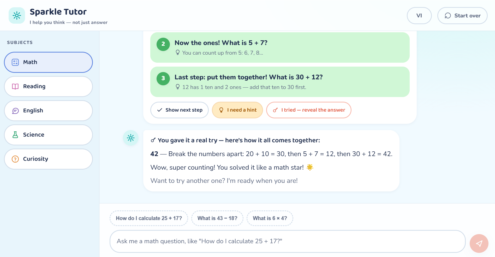

# KidGPT — Sparkle Tutor

A bilingual (Vietnamese/English) AI study buddy for kids aged 6–12. Sparkle never hands
over the answer — it guides children to find it themselves, one small question at a time,
with animated visual aids: number blocks, dot groups, letter tiles and step-flow diagrams.
A parent unlocks the app once with Google; each child then learns under their own profile.





## Why use it with children?

- **Guides, never tells** — Socratic step-by-step plans keep the child thinking; the final
  answer stays hidden behind an explicit "I tried — reveal the answer" button
- **Built for young readers** — short sentences, a warm tutor voice, cheerful visuals for
  math, spelling and science, and legacy-browser fallbacks so old family tablets still work
- **Parent-unlocked** — a parent signs in once with Google (Firebase Auth, the device stays
  signed in); each child gets their own profile, and the AI adapts to the 6–8 or 9–12 age
  band. Only a nickname, an age band and the parent's Google account are stored — never chat history
- **Safe by design** — school topics only with kind refusals, prompts that shrug off
  "just tell me the answer" tricks, strictly validated AI output, and no stored chat history
- **Bring your own AI** — works with any OpenAI-compatible endpoint (OpenAI, z.ai GLM,
  Ollama…) configured purely through environment variables

## Run locally

```bash
npm install
cp .env.example .env.local   # fill LLM_BASE_URL / LLM_API_KEY / LLM_MODEL
npx vercel dev               # open http://localhost:3000
# then follow "Firebase setup" below to unlock the app
```

## Environment variables

| Variable | Required | Description |
|---|---|---|
| `LLM_BASE_URL` | ✓ | OpenAI-compatible endpoint, e.g. `https://api.openai.com/v1` |
| `LLM_API_KEY` | ✓ | Gateway API key |
| `LLM_MODEL` | ✓ | Model name, e.g. `gpt-4o-mini` |
| `LLM_EXTRA_BODY` | – | JSON merged into the request body, e.g. `{"thinking":{"type":"disabled"}}` on z.ai for 2–3× faster replies |
| `FIREBASE_PROJECT_ID` | ✓ (with login) | Firebase project id for ID-token verification |
| `UPSTASH_REDIS_REST_URL` / `UPSTASH_REDIS_REST_TOKEN` | – | Enables 20 req/5 min/account/endpoint rate limiting (skipped when unset) |

## Tests

```bash
npm test
```

## Deploy (Vercel)

Import the repo (preset "Other") — `public/` is served statically and `api/` becomes
Serverless Functions. Set the environment variables in Project Settings. Security headers
live in `vercel.json`. Design spec, implementation plan and the manual QA checklist are
under `docs/`.

## Firebase setup (login + profiles)

1. Create a free Firebase project → Authentication → Sign-in method → enable **Google**
2. Create a **Firestore** database (production mode)
3. Register a Web app (Project settings → Your apps), then copy its config into `public/firebase-config.js` (apiKey/authDomain/projectId/appId — public by design)
4. Paste the owner-only security rules from `docs/superpowers/specs/2026-09-17-kidgpt-auth-design.md` §4 into Firestore → Rules
5. Set `FIREBASE_PROJECT_ID` on Vercel; add your deployed domain to Authentication → Settings → Authorized domains
